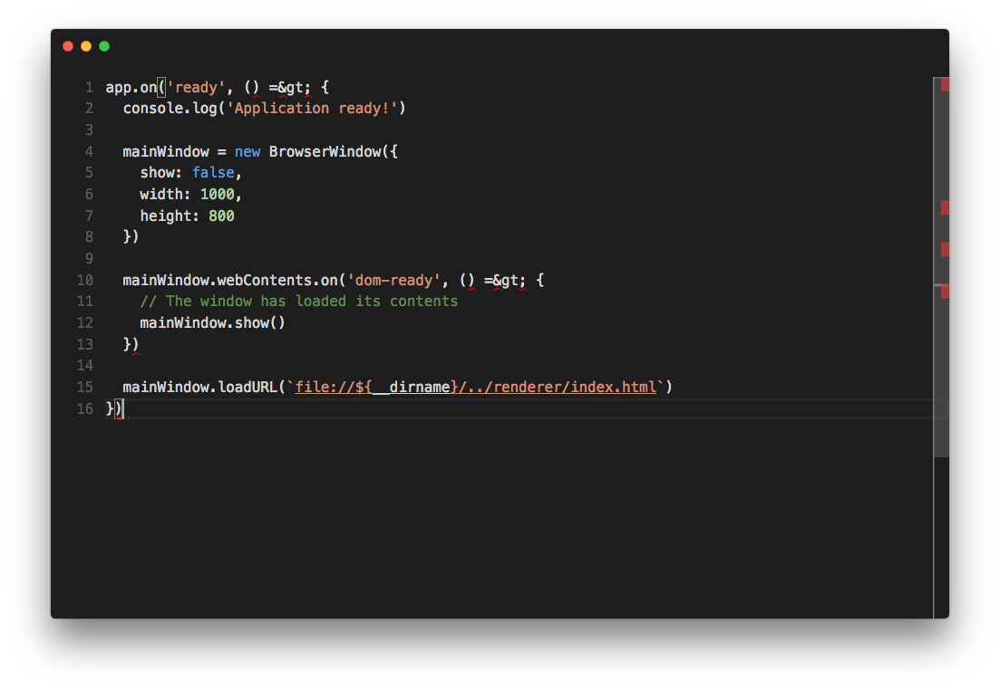

# "Introducing Electron" (The editor)
In this repository, you will find each step and code example from the guide "Introducing Electron". It includes both the "Hello World" exercise (a simple code editor) as well as example implementations for each feature discussed in the "Working with Electron" section.

### Exercise
 - [Initial 'Hello World' (Node)](https://github.com/felixrieseberg/introducing-electron-editor/commit/1766093d0e3bf3aebb240fafee0e300bcfc951e0)
 - [Initial 'Hello World' (Electron)](https://github.com/felixrieseberg/introducing-electron-editor/commit/30b8ebb6a46dd129fe83adac259eff0711946a24)
 - [Initial 'Hello World' (Electron, app)](https://github.com/felixrieseberg/introducing-electron-editor/commit/66ac8aa68a1e2aa33a252284060f89375b969f6c)
 - [A first BrowserWindow](https://github.com/felixrieseberg/introducing-electron-editor/commit/366a1e34785169a5c6196dcfee2ea3b276835009)
 - [A first BrowserWindow (with contents)](https://github.com/felixrieseberg/introducing-electron-editor/commit/bb5708011d66e87a1d66e9ca73420e4f3b8b0d78)
 - ['Hello World' from the renderer process](https://github.com/felixrieseberg/introducing-electron-editor/commit/75f8dd86cb83dcb9e7063830e53b20bd4bb4f714)
 - [An editor is born](https://github.com/felixrieseberg/introducing-electron-editor/commit/c199638aff010b6c596e13184e47466926bbc7db)

At the end of this exercise (and at the current state of the `master` branch), you can start the editor running `npm start`.

### Code examples
All of these examples build on top of the `master` branch to illustrate the usage of a pattern discussed in the book.

##### Showing Windows Gracefully
 - [Graceful window showing using backgroundColor](https://github.com/felixrieseberg/introducing-electron-editor/commit/6a368a2c53f2150e85b3f9da72b4e0d0a568ad55)
 - [Graceful window showing using the remote](https://github.com/felixrieseberg/introducing-electron-editor/commit/3e3dbf66359653f18b2efdd8591b967e3f7dff30)

##### Native Dialogs
 - [A native question dialog](https://github.com/felixrieseberg/introducing-electron-editor/commit/837c081742e44672305c1107792ddd99788cc9ee)
 - [A native open file dialog](https://github.com/felixrieseberg/introducing-electron-editor/commit/e78d3759c0f1b5225447e18113754990c1259e83)
 - [A native save file dialog](https://github.com/felixrieseberg/introducing-electron-editor/commit/1ba2d60e93d29a20e350ab192c0f0cdd83ffe145)

##### Native Menus
 - [A native context menu](https://github.com/felixrieseberg/introducing-electron-editor/commit/7aa7fc8ea1279b8f89328d42e0f9710c3674f04b)

##### Native Notifications
 - [Sending a window.Notification](https://github.com/felixrieseberg/introducing-electron-editor/commit/73d3f716d9ab3700a04d0dafae6447845eded931)
 - [Sending an Electron notification](https://github.com/felixrieseberg/introducing-electron-editor/commit/128ddd83f39f7e47b36722207ca0b81df64b6f1f)

##### Inter-Process Communication
 - [A game of ping-pong](https://github.com/felixrieseberg/introducing-electron-editor/commit/5be451c29a3992d75d51855387bccbe0f28a8728)
